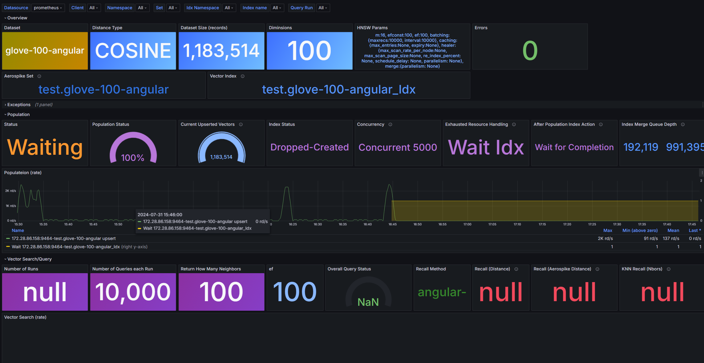
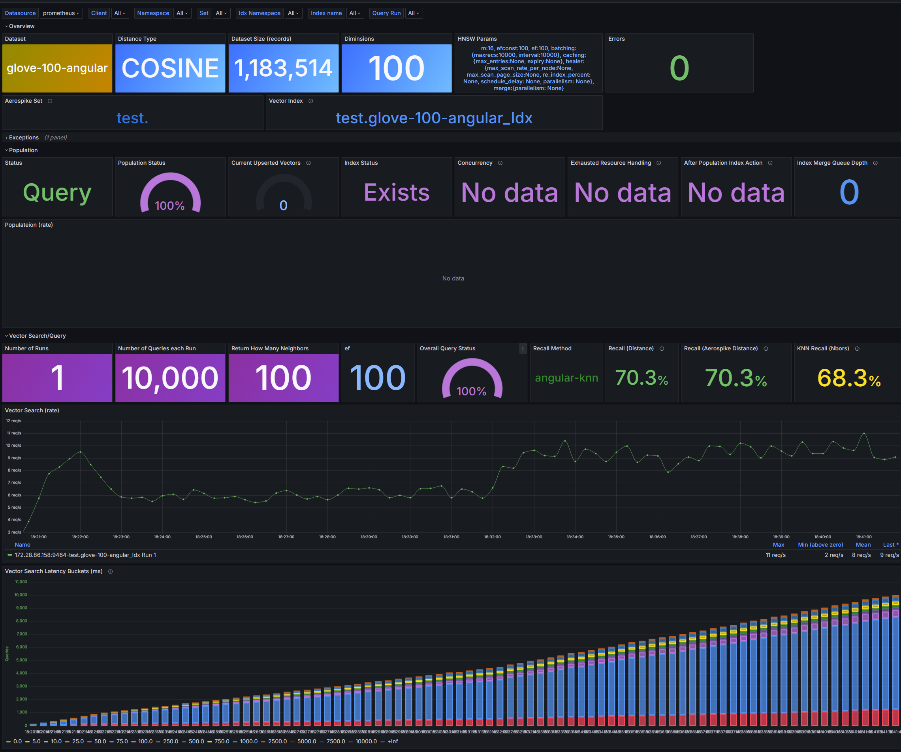

# hdf_import.py

This module will import a generated ANN HDF dataset. If the dataset doesn’t locally exist, it will be imported from ANN repro. All datasets are cached in the “./data” folder.

You can obtain a list of arguments by running:

```
python hdf_import.py –help
```

Below is a review of the argument:

\-h, --help

Show this help message and exit

\-d DS, --dataset DS

The ANN dataset (DS) to load training points from (default: glove-100-angular)

\--hdf HDFFILE

A HDF file that can be an ANN HDF file, or one created by “[hdf_create_dataset.py](#hdf_create_datasetpy)”. You can provide a path to this HDF file. If a path is not provided, the “data” folder is assumed.

\-c N, --concurrency N

The maximum number of concurrent tasks (N) used to population the index.

“N’ Values are:

-   \< 0 – All records are upserted, concurrently waiting for the upsert confirmation once all upserts are submitted
-   0 -- Disable Population  
    If the index doesn’t existence, it is created. The “wait for index completion” is still being performed.
-   1 -- One record is upserted and confirmed at a time (sync)
-   \> 1 -- The number of records upserted and confirmed, concurrently (async)

    After population occurs, the module will go into “wait for index completion” mode by default. When this occurs, the module will wait until all populated index records are merged into the Aerospike DB.

    (default: 500)

\--idxdrop

If the Vector Index existence, it will be dropped. Otherwise, it is updated. (default: False)

\--idxnowait

Waiting for index completion is disabled. The module will continue without waiting for the index records to be merged into the Aerospike DB (default: False)

\-E EVT, --exhaustedevt EVT

This determines how the Resource Exhausted event is handled. This event occurs with the Vector Server merge queue is filled and cannot process any additional population requests.

“EVT” Values are:

-   \< 0 – All population events are stopped and will not resume until the index merger queue is cleared. This is done by “waiting for index completion” to occur. Once the queue is cleared, the population will be restarted.
-   0 -- Disable event handling (just re-throws the exception)
-   \>= 1 – All population events are stopped, and the module will wait for “EVT” seconds. Once the interval is reached, the population will be restarted.

    (default: -1)

\-m RECS, --maxrecs RECS

Determines the maximum number of records to populated. A value of -1 (default) all records in the HDF dataset are populated.

(default: -1)

\-p port, --vectorport port

The Vector Server Port (default: 5000)

\-a HOST, --host HOST

The Vector Server’s IP Address or Host Name (default: localhost)

\-A HOST:PORT [HOST:PORT ...], --hosts HOST:PORT [HOST:PORT ...]

A list of host and optional port. Each pair is separated by a space.  
Example: 'hosta:5000' or 'hostb' (default: [localhost:5000])

If provided, each population request is distributed over the list of hosts.

Note: if this is provided, “—host” and “—port” arguments are ignored.

\-l, --vectorloadbalancer

Use Vector's Load Balancer.

Note: if “—hosts” argument is used, only the first host in the list is used (reminding hosts are ignored)

(default: False)

\-n NS, --namespace NS

The Aerospike Namespace  
(default: test)

\-N NS, --idxnamespace NS

Aerospike Namespace where the vector index will be located.  
Defaults to the value of “—namespace”.

\-s SET, --setname SET

The Aerospike Set Name  
(default: HDF-data)

\-I IDX, --idxname IDX

The Vector Index Name.  
Defaults to the Set Name (--setname) with the suffix of '_idx'

\-g, --generatedetailsetname

Generates a unique Set Name (--setname) based on distance type, dimensions, index params, etc.  
(default: False)

\-b BIN, --vectorbinname BIN

The Aerospike Bin Name where the vector is stored  
(default: “HDF_embedding”)

\-D DIST, --distancetype DIST

The Vector's Index Distance Type as defined by the Vector Phyton API.  
The default is to select the index type based on the ANN dataset

\-P PARM, --indexparams PARM

The Vector's Index Params (HnswParams) as defined by the Vector Phyton API.  
(default: {"m": 16, "ef_construction": 100, "ef": 100})

\-L LOG, --logfile LOG

The logging file path, if provided. The default is to stdout.

\--loglevel LEVEL

The Logging level (default: INFO)

\--driverloglevel DLEVEL

The Vector Phyton Driver's Logging level (default: NOTSET)

\--prometheus PORT

The Prometheus Port (default: 9464)

\--prometheushb SECS

Prometheus heartbeat in secs. The heartbeat updates common information to Prometheus (default: 5 seconds)

\--exitdelay wait

Upon exist, the module will sleep ensuring all Prometheus events are captured (default: 20)

# hdf_query.py

This module will query using the ANN neighbor query vector defined in the ANN dataset that was downloaded and populated using [hdf_import.py](#hdf_importpy).

If the dataset is an ANN “Euclidean”, the Aerospike returned distances are converted to match the ANN Euclidean distances for proper recall. This behavior can be overridden by the “dontadustdistance” switch.

You can obtain a list of arguments by running:

```
python hdf_import.py –help
```

Below is a review of the argument:

\-h, --help

Show this help message and exit

\-d DS, --dataset DS

The ANN dataset (DS) to load training points from (default: glove-100-angular)

\--hdf HDFFILE

A HDF file that can be an ANN HDF file, or one created by “[hdf_create_dataset.py](#hdf_create_datasetpy)”. You can provide a path to this HDF file. If a path is not provided, the “data” folder is assumed.

\-r RUNS, --runs RUNS

The number of times the query requests will run based on the ANN dataset.  
For example: If the ANN dataset request 1,000 queries and if this value is 10; The total number of query requests will be 10,000 (1,000 \* 10).  
(default: 10)

\--limit NEEIGHBORS

The number of neighbors to return from each query request. If this value is less than or equal to 0, the dataset's neighbor result array length will be used. (default: -1)

\--parallel

Each “run” is conducted concurrently  
(default: False)

\--check

Each query result is checked to determine if the result is correct.  
{default False)

\-p port, --vectorport port

The Vector Server Port (default: 5000)

\-a HOST, --host HOST

The Vector Server’s IP Address or Host Name (default: localhost)

\-A HOST:PORT [HOST:PORT ...], --hosts HOST:PORT [HOST:PORT ...]

A list of host and optional port. Each pair is separated by a space.  
Example: 'hosta:5000' or 'hostb' (default: [localhost:5000])

If provided, each query request is distributed over the list of hosts.

Note: if this is provided, “—host” and “—port” arguments are ignored.

\-l, --vectorloadbalancer

Use Vector's Load Balancer.

Note: if “—hosts” argument is used, only the first host in the list is used (reminding hosts are ignored)

(default: False)

\-N NS, --idxnamespace NS

Aerospike Namespace where the vector index will be located.  
Defaults to the value of “—namespace”.

\-s SET, --setname SET

The Aerospike Set Name  
(default: HDF-data)

\-I IDX, --idxname IDX

The Vector Index Name.  
Defaults to the Set Name (--setname) with the suffix of '_idx'

\-g, --generatedetailsetname

Generates a unique Set Name (--setname) based on distance type, dimensions, index params, etc.  
(default: False)

\-S PARM, --searchparams PARM

The Vector's Search Params (HnswParams) as defined by the Vector Phyton API.  
Defaults to --indexparams

\--metric TYPE

Determines how recall is calculated. Defaults to “KNN”. Possible values are:

-   knn (default)
-   epsilon -- Epsilon 0.01 Recall
-   largeepsilon -- Epsilon 0.1 Recall
-   rel -- Relative Error

\--distancecalc TYPE

If provided, this will override the ANN distance type as defined in the dataset. The default is the ANN defined distance type. Values can be:

-   hamming
-   jaccard
-   euclidean
-   squared_euclidean
-   angular

\--dontadustdistance  
If provided, the ANN default distance formula is always used regardless of the ANN or “distancecalc” values.

\-L LOG, --logfile LOG

The logging file path, if provided. The default is to stdout.

\--loglevel LEVEL

The Logging level (default: INFO)

\--driverloglevel DLEVEL

The Vector Phyton Driver's Logging level (default: NOTSET)

\--prometheus PORT

The Prometheus Port (default: 9464)

\--prometheushb SECS

Prometheus heartbeat in secs. The heartbeat updates common information to Prometheus (default: 5 seconds)

\--exitdelay wait

Upon exist, the module will sleep ensuring all Prometheus events are captured (default: 20)

# hdf_create_dataset.py

This module creates an HDF file from an existing vector dataset. This dataset can be an ANN or a user defined dataset.

\-h, --help

show this help message and exit

\-idx INDEXNAME, --indexname INDEXNAME

Vector's Index Name. Required

\--hdf HDFFILE

A HDF file that will be created in the 'data' folder by default. You can provide a path, if for a different folder. Required

\-a HOST:PORT [HOST:PORT ...], --hosts HOST:PORT [HOST:PORT ...]

A list of Aerospike host and optional ports (defaults to 3000). Example:

'hosta:3000' or 'hostb' (default: ['localhost:3000'])

\--policies POLICIES

Aerospike connection policies

(default: {"read": {"total_timeout": 1000}})

\-A HOST:PORT [HOST:PORT ...], --vectorhosts HOST:PORT [HOST:PORT ...]

A list of Aerospike Vector host and optional ports (defaults to 5000).

Example: 'hosta:5000' or 'hostb' (default: ['localhost:5000'])

\-l, --vectorloadbalancer

Use Vector's DB Load Balancer (default: False)

\-idxns INDEXNAME, --indexnamespace INDEXNAME

Vector's Index Namespace.

(default test)

\-S PARM, --searchparams PARM

The Vector's Search Params (HnswParams) as a Json value used to obtain the neighbors

\-pk BINNAME, --pkbinname BINNAME

The Bin Name that represents the Primary Key for a record. If not provided the Aerospike PK will try to be used, if the PK value is returned.

If the Aerospike PK is not a value (digest), PK array will not be part of the HDF dataset. (default: \_avs_uk_)

\--records LIMIT

The number of records (PKs) returned from the application Aerospike Set. If -1, all records are returned from the set. (default: -1)

\-n NEIGHBORS, --neighbors NEIGHBORS

The number of neighbors to return from the query. (default: 100)

\--testsize VALUE

If float, should be between 0.0 and 1.0 and represent the proportion of the dataset to include in the test split.

If int, represents the absolute number of test samples.

If None, the value is set to the complement of the train size. If \`\`trainsize\`\` is also None, it will be set to 0.25

(default: 0.1)

\--trainsize VALUE

If float, should be between 0.0 and 1.0 and represent the proportion on the dataset to include in the train split.

If int, represents absolute number of train samples. If None, the value is automatically set to the complement of the test size.

(default: None)

\--randomstate VALUE

Controls the shuffling applied to the data before applying the split. Pass an int for reproducible output across multiple function calls.

Can be an int, RandomState instance or None.

Using a default of 1 as defined in the ANN benchmark. See this [link](https://scikit-learn.org/dev/modules/generated/sklearn.model_selection.tr) for more information.

(default: 1)

\--usetrainingds

Creates the training dataset based on the actual vectors from the DB. This will use the Bruteforce/k-nn method to calculate the neighbors. The default is to use all vector records in the DB and a sampling is taken to conduct the searches using the Aerospike implementation.

(default: False)

\--metric TYPE

Which metric to use to calculate Recall.

(default: k-nn)

\-L LOG, --logfile LOG

The logging file path. The default is no logging to a file.

(default: None)

\--loglevel LEVEL

The Logging level

(default: INFO)

### HDF File Attributes

-   type – A constant value which is always "dense"
-   distance – An ANN distance type. The is a string value. Values are:

    'angular', 'euclidean', 'hamming', 'jaccard', or 'dot'

-   dimension – Thedimension of the training dataset (int)
-   point_type – The training dataset’s element type (float, int, etc.). A string value…
-   recall – The recall calculated value based on the recall method. (int, float, None)
-   recallmethod – The recall method as string (e.g., k-nn, epsilon, largeepsilon, etc.)
-   train – The training dataset
-   test – The testing dataset which contains the vectors used to search for neighbors
-   neighbors – the expected neighbors dataset based on a search on the test dataset
-   distances – An array of distance calculations or None
-   primarykeys – A list of primary keys from the application set used to obtain the vectors.
-   vector_distance -- The Aerospike distance type (VectorDistanceMetric)
-   hnsw -- The hnsw parameters defined when the index was created

# Big ANN Datasets

You can create a HDF5 file that can be used by the ANN framework or “Standalone ANN”, The Big ANN datasets are in a different format than the “standard” ANN HDF5 file.

To convert from a Big ANN format to an ANN HDF5 file you must perform these two steps:

1.  Call the bigann_download.py program to download the Big ANN files
2.  Call bigann_convert_hdf.py that will convert from the Big ANN files to the HDF5 file

## bigann_download

This will download the Big ANN dataset files and place the files into the default “data” folder where the dataset name will be a sub-folder within this folder. **This requires the following applications installed in your environment:**

-   **axel**
-   **azcopy**

Below are the arguments:

-   \--dataset name  
    You can find more information about the Big ANN datasets [here](https://big-ann-benchmarks.com/neurips23.html). Name is:
    -   'bigann-1B'
    -   'bigann-100M'
    -   'bigann-10M'
    -   'deep-1B'
    -   'deep-100M'
    -   'deep-10M'
    -   'msturing-1B'
    -   'msturing-100M'
    -   'msturing-10M'
    -   'msturing-1M'
    -   'msturing-10M-clustered'
    -   'msturing-30M-clustered'
    -   'msspacev-1B' 'msspacev-100M'
    -   'msspacev-10M' 'msspacev-1M'
    -   'yfcc-10M' 'yfcc-10M-unfiltered'
    -   'yfcc-10M-dummy-unfiltered'
    -   'random-xs'
    -   'random-s'
    -   'random-xs-clustered'

## bigann_convert_hdf

This will convert a previously downloaded Big ANN dataset into the standard ANN HDF5 file.

The arguments are:

-   \--dataset name – The Big ANN dataset name as defined and download from [bigann_download](#bigann_download).
-   \--hdf HDFFILE – The name of the HDF5 file that will be created in the “data” folder. This file will have the following attributes:
    -   dimension – The dimensions of the training vector as defined by the Big ANN dataset
    -   distance – The distance type
    -   defaultsearchcount-- The default search count as defined by Big ANN
    -   point_type – The point type
    -   metrictype– The metric type used to calculate distance. Currently only support “KNN”. This is associated to the “search type” in Big ANN.
    -   sourcedataset – The Big ANN dataset name
    -   type – Always "dense"
    -   distances – A collection of vectors and shape of the test results distances as defined in the Big ANN dataset
    -   neighbors -- A collection of vectors and shape of the test results neighbors as defined in the Big ANN dataset
    -   test -- A vector and shape of the test vectors used to obtain the results as defined in the Big ANN dataset
    -   train -- A vector and shape of the training vectors used to by training to query the DB
-   \-- distancesquareeuclidean – If the Big ANN dataset is a Squared Euclidean distance type. This switch should be used so that the distances are properly converted to work with the ANN framework. If this switch is not provided the ANN will compute the incorrect Recall value.

# Prometheus

The module outputs certain meters to Prometheus. They are:

-   `aerospike.hdf.heartbeat This event is defined as a gauge. It provides information about the status of the module including the following attributes:`
    -   `"ns” – Aerospike Namespace`
    -   `"set” – Aerospike Set                                                   `
    -   `"idxns” – Aerospike Vector Index Namespace`
    -   `"idx" – The Aerospike Vector Index Name                                                     `
    -   `"idxbin" – The Vector’s Bin Name`
    -   `"idxdist" – The Vector’s API Distance Type`
    -   `"dims" – Vector’s dimensions`
    -   `"poprecs" – The number of records in the ANN dataset that will be populated`
    -   `"queries": The total number of queries used for this dataset `
    -   `“querynbrlmt” – The number of possible neighbors to return for the query`
    -   `“queryruns” – The number of query runs. Each run will perform a set of define queries. The number is defined in “queries”. `
    -   `"querycurrun" – The current query run                                                  `
    -   `"querymetric – The recall method used`
    -   `"querymetricvalue" – The recall calculated value based on recall method`
    -   `"dataset” – The ANN dataset`
    -   `"paused" – The run status. Values are:`
        -   `Waiting – waiting for index completion`
        -   `Paused – paused due to resource exhausted`
        -   `Running - Populating`
        -   `Idle – before population, after, or after waiting…`
        -   Collecting HDF – Obtaining information from the HDF file
        -   AVS Status – Connecting to the AVS server and obtaining index information
        -   Query – Performing a Query action
        -   `Done – Population/Wait done`
    -   `"action” – If importing (populating) or querying`
    -   "remainingRecs" – The current number of records that have not been populated
    -   "remainingquerynbrs” - The total number of queries (includes all runs) that have not been executed
    -   "hnswparams" -- The Vector Index's HNSW params
    -   "queryef" -- The query's "ef" value
    -   “popresrcevt" – during population, the resource exhausted event handling. Values are:
        -   Wait Idx – Wait for Index to Complete before proceeding
        -   Sleep N – Sleep N seconds until proceeding
        -   Exception – Rethrow the resource exhausted exception
    -   "popconcurrent” – during population the concurrency action of the upserts. Values are:
        -   All – All records are upserted, concurrently
        -   Concurrent N – Records are upseted N records concurrently, at a time. Once the records are submitted, the application waits for server to respond before the next N records are submitted.
        -   Single – One record is submitted and waits for the sever upsert response
        -   Disabled – Population is disabled
    -   "popwait" – The action taken once all records are upserted into the DB. Values are:
        -   Wait for Completion – Wait for the server to acknowledge that all upsets are committed to the database.
        -   No Wait – The application doesn’t wait for acknowledgement and eventually the upserts will be committed.
    -   "idxstate" – Provides if the index already existed, newly created, or dropped and re-created.
-   `aerospike.hdf.populate Current record rate that have been upserted. Defined as a counter. Attributes:`
    -   `"type" -- upsert`
    -   `"ns" -- Namespace`
    -   `"set" – Set Name`
-   `aerospike.hdf.query Current query rate. Defined as a counter. Attributes:`
    -   `"ns" -- Namespace`
    -   `"` `idx" – Index Name`
    -   `“run” – The run associated with this query`
-   `aerospike.hdf.exception Current exception rate. Defined as a counter. Attributes:`
    -   `"exception_type" – Type of exception`
    -   `"handled_by_user" – if handled by user code`
    -   `"ns" -- Namespace`
    -   `"set" – Set`
    -   `“idx” – Index name`
-   `aerospike.hdf.waitidxcompletion Current number of waiting for index merge completions being conducted. Defined as a counter. Attributes:`
    -   `"ns" – Index Namespace`
    -   `"idx" – Index Name`
-   `aerospike.hdf.dropidxtime The amount of time (sec) to perform an index drop. Defined as a histogram. Attributes:`
    -   `"ns" – Index Namepsace`
    -   `"idx" – Index Name`
-   `aerospike.hdf.queryhist The amount of time (ms) to perform vector search. Defined as a collection of buckets. Attributes:`
    -   `"ns" – Index Namepsace`
    -   `"idx" – Index Name`
    -   `"run" – Run associated with this query latency buckets`

# Supported Datasets

-   deep-image-96-angular
-   fashion-mnist-784-euclidean
-   gist-960-euclidean
-   glove-25-angular
-   glove-50-angular
-   glove-100-angular
-   glove-200-angular
-   mnist-784-euclidean
-   random-xs-20-euclidean
-   random-s-100-euclidean
-   random-xs-20-angular
-   random-s-100-angular
-   random-xs-16-hamming
-   random-s-128-hamming
-   random-l-256-hamming
-   random-s-jaccard
-   random-l-jaccard
-   sift-128-euclidean
-   nytimes-256-angular
-   nytimes-16-angular
-   sift-256-hamming
-   kosarak-jaccard
-   movielens1m-jaccard
-   movielens10m-jaccard
-   movielens20m-jaccard
-   dbpedia-openai-100k-angular
-   dbpedia-openai-200k-angular
-   dbpedia-openai-300k-angular
-   dbpedia-openai-400k-angular
-   dbpedia-openai-500k-angular
-   dbpedia-openai-600k-angular
-   dbpedia-openai-700k-angular
-   dbpedia-openai-800k-angular
-   dbpedia-openai-900k-angular
-   dbpedia-openai-1000k-angular

## Possible additional sites (can be more)

Any new dataset needs to be defined to mini-ANN.

-   <https://archive.ics.uci.edu/>
-   <http://fimi.uantwerpen.be/data/>
-   <http://files.grouplens.org/datasets/movielens/>

## Dashboard

You can import the dashboard from [here](https://github.com/aerospike-community/ann-benchmarks/blob/main/aerospike/AerospikeHDFDashboard.json) (AerospikeHDFDashboard.json).

### hdf-import dashboard example



### hdf-query dashboard example


